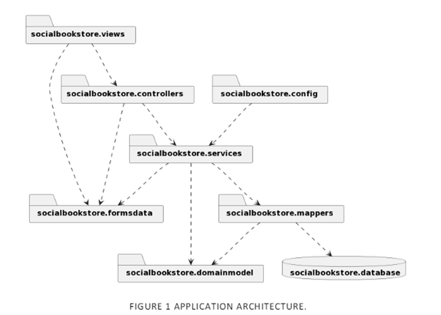

# Social Bookstore Application

## Description

The Social Bookstore Application is an online platform designed to facilitate the exchange of used books among individuals for free. The project aims to fulfill this objective using a Scrum approach to resolve organizational issues, while leveraging technologies such as the Spring Boot Framework and MySQL to satisfy functional requirements. Non-functional requirements, including design quality and best coding practices, have also been prioritized.

## Features

- **User Authentication:** Allow users to create accounts, log in, and log out.
- **User Profile:** Enable users to create profiles with personal information and preferences.
- **Book Offers:** Allow users to add books to their personal list of offers with descriptions.
- **Book Requests:** Enable users to search for and request books from other users.
- **Notification System:** Notify users about book requests and availability.
- **Database Integration:** Utilize MySQL for data storage and retrieval.
- **Testing:** Implement testing procedures to ensure application functionality.

## Application Architecture

## Installation

just run throw a modern compailer

## Technologies Used

*   [MySQL](https://www.mysql.com/) & [MySQL Workbench](https://www.mysql.com/products/workbench/) as a DBMS and database visual tool respectively.
*	[GitHub](https://github.com/) for version control.
*	[Spring Boot](https://spring.io/projects/spring-boot) as a general framework for creating the application with Java 11 as the programming language and [Maven](https://maven.apache.org/) as a build tool. Some notable dependencies were [Thymeleaf](https://www.thymeleaf.org/) as a template engine, Spring Data JPA and MySQL Driver to implement the connection with the MySQL database and Spring Boot DevTools to auto-reload the project when the source code is changed while the application is running.
*	[Intellij](https://www.jetbrains.com/idea/) as an IDE.
*	[JUnit 5](https://junit.org/junit5/) for testing.
*	[Discord](https://discord.com/) as a communication tool.

## Contributing

Contributions are welcome! Please follow the guidelines outlined in [CONTRIBUTING.md](link-to-contributing.md) for contributing to this project.

## Demo Images

- Authentication page - Displays the login/registration 
   

- Book Dashboard page - A list of owned books and functions that a user can do 
   
